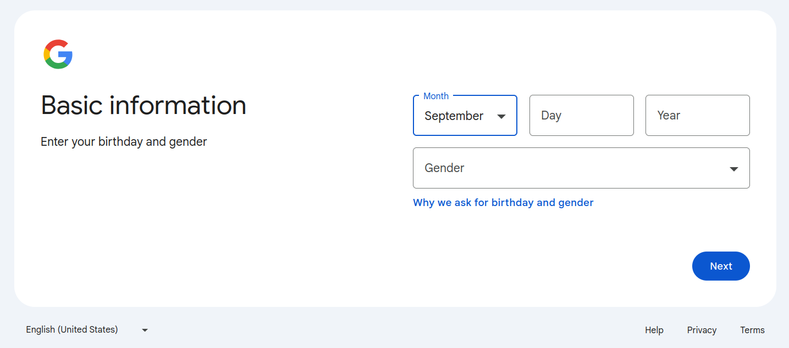

Set up GEE and GCloud
=====================

.. _GeoCARET: https://github.com/Reservoir-Research/geocaret
.. _GCloud: https://cloud.google.com
.. _GEE: https://earthengine.google.com

Running GeoCARET_ requires a Google Account which will be used to log into Earth Engine (GEE_) and Google Cloud (GCloud_). 
Historically, GEE_  was a standalone tool (service) for accessing geospatial data, such as maps, satelite images, etc. and performing computations on these datasets. However, recently, Google have been merging some of their products such as GEE_ with their cloud computing platform GCloud_ to facilitate better integration with high speed computing and large data storage facilities. Consequently, both products are closely related and starting from November 2024, GEE_ will require project folders to be integrated with GCloud_.

To use GeoCARET_ you may use your existing account. If you have one, you can skip to :ref:`ee_setup`. Otherwise, the steps below will guide you through the account installation process.

.. _setup-gmail-account:

1. Set up a new Google Email Account
------------------------------------

  
When setting up Google Account, you can choose between personal and work/business use. Both options should work just fine, however, if you'd like to use your work email address and/or expect to perform computation outside the free plan granted by Google to non-profit and research organizations, you might want to choose the latter option. Here, we choose the **For my personal use** option.

1.1 Provide personal details
~~~~~~~~~~~~~~~~~~~~~~~~~~~~

.. image:: ../_static/images/ee_installation/screen2-name-surname.png
  :width: 800
  :alt: Setting Google Account: Name-Surname

  
1.2 Set account name and password
~~~~~~~~~~~~~~~~~~~~~~~~~~~~~~~~~

.. image:: ../_static/images/ee_installation/screen4-email-name.png
  :width: 800
  :alt: Setting Google Account: email account name

.. image:: ../_static/images/ee_installation/screen5-psswd.png
  :width: 800
  :alt: Setting Google Account: set password
  
Create a new email account **(Option 1)** or use your existing email **(Option 2)**.
  
1.3 Prove you're not a robot (requires a mobile phone number)
~~~~~~~~~~~~~~~~~~~~~~~~~~~~~~~~~~~~~~~~~~~~~~~~~~~~~~~~~~~~~
  
.. image:: ../_static/images/ee_installation/screen6-robot.png
  :width: 800
  :alt: Setting Google Account: prove you're not a robot
  
.. image:: ../_static/images/ee_installation/screen7-code.png
  :width: 800
  :alt: Setting Google Account: enter code sent to mobile
  
1.4 Add recovery email address
~~~~~~~~~~~~~~~~~~~~~~~~~~~~~~

.. image:: ../_static/images/ee_installation/screen8-recovery-address.png
  :width: 800
  :alt: Setting Google Account: add recovery email address
  
.. image:: ../_static/images/ee_installation/screen9-review-account-info.png
  :width: 800
  :alt: Setting Google Account: review account info
  
.. image:: ../_static/images/ee_installation/screen10-privacy-terms.png
  :width: 800
  :alt: Setting Google Account: agree to privacy terms text
  

  
.. _ee_setup:

2. Set up Earth Engine and Google Cloud Accounts
------------------------------------------------

You must be registered with Google Earth Engine to make use of GeoCARET. You must also have a Google Cloud Project associated with your Earth Engine account, which is where the GeoCARET_ tool outputs will be stored. Once you have a suitable Google account, follow these steps to set up your Earth Engine and Google Cloud.

2.1 Register to Use Google Earth Engine
~~~~~~~~~~~~~~~~~~~~~~~~~~~~~~~~~~~~~~~

A Google account is required to access Earth Engine. To facilitate the Earth Engine registration approval process, we suggest that you use a Google account created with an email associated with your organization.
For example, if you belong to an academic institution such as a University, you can create a Google account using your institution email address. This account can be created in addition to any personal Google account you may have.
https://support.google.com/accounts/answer/27441?hl=en
Once you have a suitable Google account, follow these steps to access Earth Engine:

Navigate to https://code.earthengine.google.com.

If you have more than one Google-registered account, you will be redirected to choose which account you'd like to open Earth Engine with. Then click **Continue** and select the account on the next screen.

.. image:: ../_static/images/ee_installation/screen2-1-gee-choose-accounts.png
  :width: 800
  :alt: Eearth Engine: choose account
  
.. image:: ../_static/images/ee_installation/screen2-2-gee-choose-account2.png
  :width: 800
  :alt: Eearth Engine: select account
  
You will be directed to the initial GEE_ page asking you to register a new project or select an existing cloud project you've been authorized to use (see below). We choose **I WANT TO REGISTER A NEW PROJECT**. This will set up a project in Google Cloud that is linked to your Google Earth Engine account.

.. note:: 
   From November 13, 2024, Google requires that a Google Earth Engine has an associated Cloud project. Historically, this was not required and consequently, Earth Engine could be run without setting up GCloud.

.. image:: ../_static/images/ee_installation/screen2-3-gee-initial.png
  :width: 800
  :alt: Eearth Engine: new project

You will need to select whether the project is for commercial or non-commercial purposes. 

.. image:: ../_static/images/ee_installation/screen2-4-register-project-splash.png
  :width: 800
  :alt: Eearth Engine: new project - commercial/non-commercial
  
The choice depends on the character of your work. Since our work is non-for-profit and for research purposes only, we select a *noncommercial cloud project* with *Unpaid usage* and choose the *Academia & Research* category. Select your project type and category depending on the type of your work/organization.

.. note::
   Commercial projects require settin up billing and payment information. For noncommercial project, payments and billing are not required.

  
Click on **Create a new Google Cloud Project** and **CONTINUE TO SUMMARY**.

If you set up your account as an Organization, you may need to select your Organization in the uppermost dropdown menu. Then specify the cloud project ID and Name, or accept their default values. Click **CONTINUE TO SUMMARY**.

.. warning::
   You might get a warning stating that you must accept Google Cloud Terms of Service. It's a small bug on Google's part because no link to the Terms of Service is provided prior to the warning. Please click on the link and accept the terms before continuing further. You will be directed to GCloud website. Make sure you select the account you're setting up, in case you have more than one Google account. The screen should look like the one shown below.
   

Click **Agree and Continue**. Then go back to the prior screen and click **CONTINUE TO SUMMARY**. You should see a screen similar to the one below. If you are happy with the settings, please click **CONFIRM**.

  
You will then be redirected to Google Earth Engine code editor and shown several welcome splash screens. Go through them at your own pace. You now have a Google Earth Engine environment with a project folder linked to GCloud.

2.2 Add a Cloud Project (ONLY FOR OLD ENGINE ACCOUNTS PREDATING MANDATORY GCLOUD INTEGRATION)
~~~~~~~~~~~~~~~~~~~~~~~~~~~~~~~~~~~~~~~~~~~~~~~~~~~~~~~~~~~~~~~~~~~~~~~~~~~~~~~~~~~~~~~~~~~~~

If you have had EarthEngine account for a while and your initial installation pre-dates the changes made to GEE_ that require integration with Google Cloud, you will also need to create a Google Cloud Project and add it to your Earth Engine account. GeoCARET_ will store its outputs inside this Cloud Project. You can also follow the steps below if you'd like to have more than one Google Cloud project registered with your Earth Engine account.

Visit https://code.earthengine.google.com and click on the **‘Assets’** tab in the left-hand column.
Under the **‘CLOUD ASSETS’** section you should see either:

-  The name of an existing cloud project, or
-  The message: *“You haven’t selected any Cloud Projects yet. Click ‘Add a Project’ to access or upload assets.”*

If you need to add a Cloud Project, you have 2 options - add an existing project, or create a new one.

To add an existing project:

1. Click the **‘ADD A PROJECT’** button and the **‘Select a Cloud Project’** dialog box will appear.
2. Click the **‘Project’** box and a list of available cloud projects will appear. This list might be empty.
3. If possible, choose the appropriate project and click the blue **‘SELECT’** button. The selected project will now appear under **‘CLOUD ASSETS’**.

However, if there were no cloud projects in the list to choose from, you’ll need to add a new project:

1. First, click the **‘user’** icon at the top-right of the page, and choose **‘Register a new Cloud Project’** from the menu.
2. On the next page click **‘Register a Noncommercial or Commercial Cloud project’** and follow the step-by-step instructions as appropriate. For example, you’ll probably want to choose **‘Unpaid usage’** and set **‘Academia & Research’** as the project type.  Click **‘Next’**.
3. Choose an organization, **ID** & **name** for the project and click **‘Continue to summary’**.
4. Click **‘Confirm’** to create the new project.

Your Cloud Project will be created and you should be taken back to https://code.earthengine.google.com/, where your new project should appear under **‘CLOUD ASSETS’**. If not, click the **‘refresh’** icon, or click **‘ADD A PROJECT'** and this time your project should appear in the list.

3. Add an assets folder to the Cloud Project
--------------------------------------------

Before GeoCARET can be used the **Cloud Project** must contain at least one top-level **‘assets’** folder, which is where GeoCARET_ will store its outputs (inside a sub-folder it will create for you). Without this asset folder GeoCARET will complain about not being able to set up the tree structure of folders prerequisite for running analyses. Any name conforming to Earth Engine naming convention is allowed.

Click on the **‘expand’** icon next to the name of the project in the *CLOUD ASSETS* tree, to check if it contains any folders. If there are no folders under the project, you’ll need to add one. If there already is a folder, but you’d like to use a different one, you’ll need to add it. To add a folder, click the red **‘NEW’** button and choose **‘Folder’** from the menu. 
Enter a name for the folder when prompted.

.. image:: ../_static/images/ee_installation/add-asset-folder.png
  :width: 800
  :alt: Eearth Engine: new project - Add asset folder

.. attention::

    GeoCARET will use the *first* folder it finds alphabetically, so bear this in mind if adding more than one top-level folder to your Cloud Project.

 

  

  

