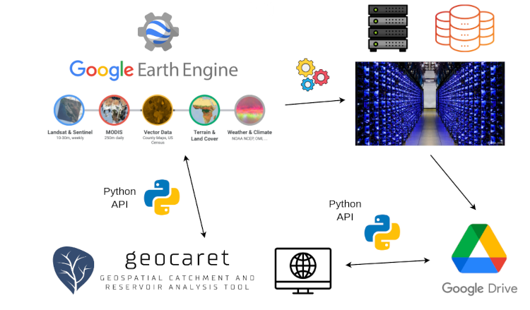

Introduction
============

.. _GEE: https://earthengine.google.com/
.. _G-Res: https://www.hydropower.org/publications/the-ghg-reservoir-tool-g-res-technical-documentation
.. _RE-Emission: https://github.com/tomjanus/reemission
.. _GeoCARET: https://github.com/Reservoir-Research/geocaret
.. _gdown: https://pypi.org/project/gdown/

GeoCARET_ provides a *Python* interface for *Google Earth Engine* (GEE_): A planetary-scale platform for Earth science data & analysis.

Functionality
-------------

GeoCARET_ was created to provide the following functionalities:

* To allow **scheduling large jobs on Google Earth Engine** from within the *Python* programming language. By large jobs we mean computations larger than what can be put into single scripts within the *Google Earth Engine*'s scripting window and involving several consecutive calculations where the outputs from the previous calculation steps are required as inputs in the next calculation steps.
* To **Automate the process of uploading inputs and downloading outputs** between local machines and *Google Earth Engine*'s servers. This step eliminates manual steps associated with data handling.
* To enable **executing computations** on *Google Earth Engine* **from Command Line**. 

Architecture
------------

A high-level architecture of GeoCARET_ and its functional interconnections with *Google Earth Engine* and *Google Drive*, is illustrated in `Figure 1`_. 
GeoCARET_ uses *Google Earth Engine* (GEE_) for geospatial computation on publicly available assets accessible openly from within the GEE_ platform as well as the private assets stored in the users' project folders.
The computations and data storage are handled on the Google's dedicated servers.
GeoCARET_ communicates with GEE_ via the `Earth Engine Python API <https://developers.google.com/earth-engine/tutorials/community/intro-to-python-api>`_.
Data exchange between the user's local computer and GEE_ is facilitated via *Google Drive* linked to the user's Google account.
The communication is facilitated via the designated *Python API* and with the help of the *Google Drive Downloader* gdown_.

|

.. _Figure 1:

**Figure 1** Functional diagram illustrating connections between **GeoCARET**, **Google Earth Engine** and **Google Drive** for uploading inputs, scheduling calculations and saving outputs to Google Drive and local folders.

The usage of GeoCARET_ follows the following steps: (1) Uploading input data from the local folder to GEE_, (2) Running Calculations on GEE_, (3) Fetching Outputs from Google Drive to the local folder.

.. _Origins:

Origins
-------

GeoCARET_ originated from a research project aimed at automating the estimation of greenhouse gas (GHG) emissions from reservoirs. Automation was essential to facilitate the analysis of emissions from multiple reservoirs, which preclude all the time-consuming manual operations that had been previously required for estimating reservoir emissions. GeoCARET_ provides inputs to the state-of-the-art reservoir emission model G-Res_, which is utilized in our open-source software RE-Emission_.

G-Res_ requires a significant amount of input data, including environmental and climatic properties of reservoir catchments, as well as the morphology and characteristics of the inundated areas associated with reservoir creation. Initially, obtaining this data was time-consuming because it required manual delineation of the catchment and reservoir contours for each reservoir being analyzed, followed by calculations of the various properties of the catchment and reservoir, respectively.

GeoCARET_ was developed to automate the process of calculating input data for G-Res_ (and Re-Emission_) by streamlining the delineation of reservoirs and catchments and the calculation of their parameters. This automation leverages global geospatial data layers related to hydrological, geomorphological, climatic, and land characteristics.

.. note::
   GeoCARET is currently used solely for its intended initial purpose, albeit it is undergoing active (re)development to enable more applications - see Vision_.

.. _Vision:

Vision
------

GeoCARET_ is under active development.
We are working towards changing GeoCARET_ from being a specialized tool serving a single purpose to being a more generic framework for running and formulating various calculation jobs related to reservoir and catchment analysis.

Our vision for the software is to make it into a collection of classes for building and orchestrating task pipelines which can achieve various tasks defined by the user. 
In this manner it can be used to facilitate different computations related to reservoirs and catchments that could be of use to the water community.

Some of the examples of such new applications can be:

* Calculation of bathymetric tables for new (proposed) reservoirs.
* Detection of reservoirs from land cover maps and/or other remote sensing layers.
* Calculation of other reservoir and catchment metrics, such as e.g. displaced population by reservoir creation.

What follows, this documentation is expected to undergo many changes as the software architecture evolves to incorporate new features.
   

