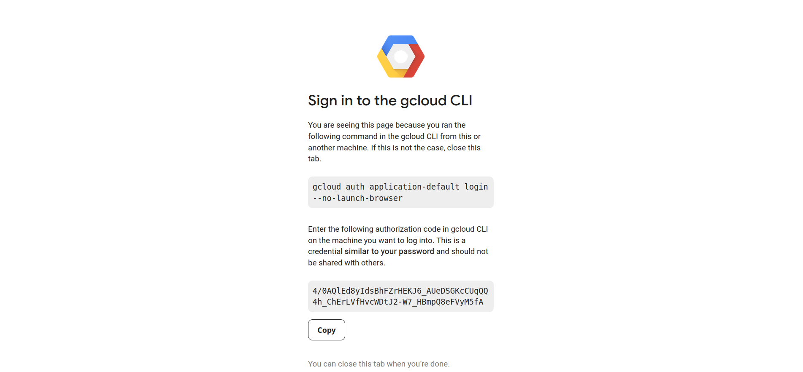

First Run
=========

.. _GeoCARET: https://github.com/Reservoir-Research/geocaret
.. _GCloud: https://cloud.google.com
.. _GEE: https://earthengine.google.com

When you run GeoCARET_ for the first time, you will need to authenticate your GEE_ access with *OAuth2*. You will be shown a link in your console window that you will need to open in a browser. The link will forward you to the site where you will have to choose the Google account to sign into (see below). 

  
After selecting your Google Account, you will be redirected to a page where you'll be asked to *Allow* Google Auth Library to access your Google Account. Upon clicking **Allow**, you will be shown a screen with the **authorization code**
  

Copy the code into the terminal. If all goes well, you will be provided with the information about *Successfully saved authorization token.* and the analysis will continue.

.. attention::
   After pasting in the code you may get the followig warning. `These credentials will be used by any library that requests Application Default Credentials (ADC). WARNING: Cannot find a quota project to add to ADC. You might receive a "quota exceeded" or "API not enabled" error. Run $ gcloud auth application-default set-quota-project to add a quota project.'
   
   We haven't yet found the lack of a quota project, as highlighted by this warning, to cause any issues while running computation tasks with GeoCARET. In case you run into this issue in your own work, you can set quota settings in GCloud vai browser, or using `gcloud` command line interface (CLI).

Subsequent Runs
===============

.. note::
   During a GeoCARET run you may see a deprecation warning - DeprecationWarning: 
   Attention required for NASA_USDA/HSL/SMAP10KM_soil_moisture! You are using a deprecated asset.
   To ensure continued functionality, please update it.
   Learn more: https://developers.google.com/earth-engine/datasets/catalog/NASA_USDA_HSL_SMAP10KM_soil_moisture
   
   The warning informs of the availability of a new asset for computing soil moisture. We will slowly migrate to the new asset. However, for the time-being, all calculations using `NASA_USDA/HSL/SMAP10KM_soil_moisture` should work just fine and return corret results.
